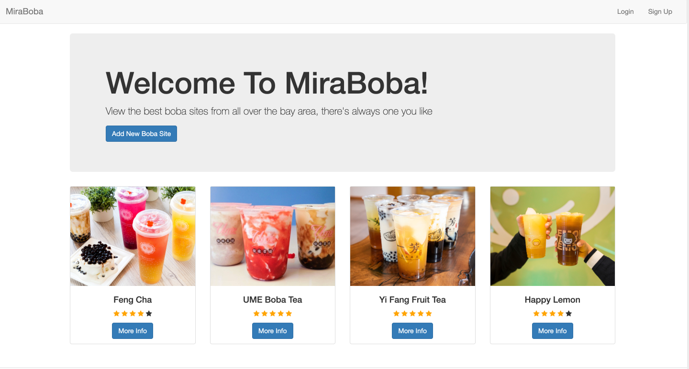
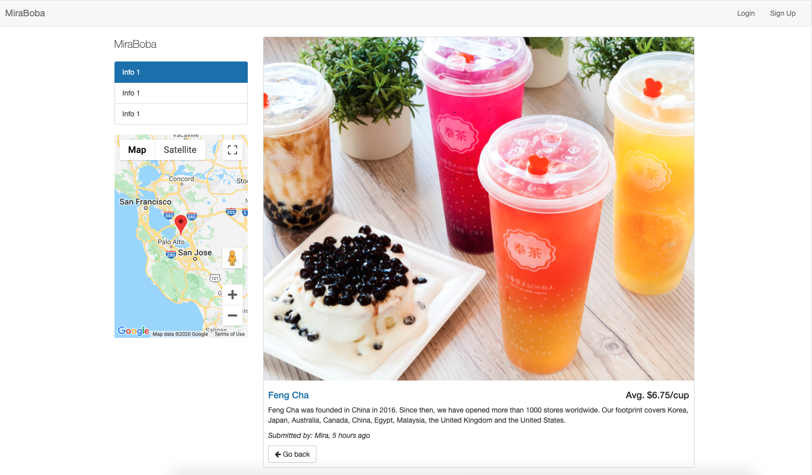

# YelpBoba-Tea-Website

#### Stack applied: Javascript, Node.js, MongoDB 
#### Feature under building: A recommendation system based on collabarating filter by funk SVD(a matrix factorization ML method) 

This is a Yelp-style boba tea website for residents in bay area. Users can search their favorite boba tea spots on the site, they can also write reviews and give ratings
for the shops they've been; besides, they can always add new boba spots and edit them if they want.

 
 

 
 

